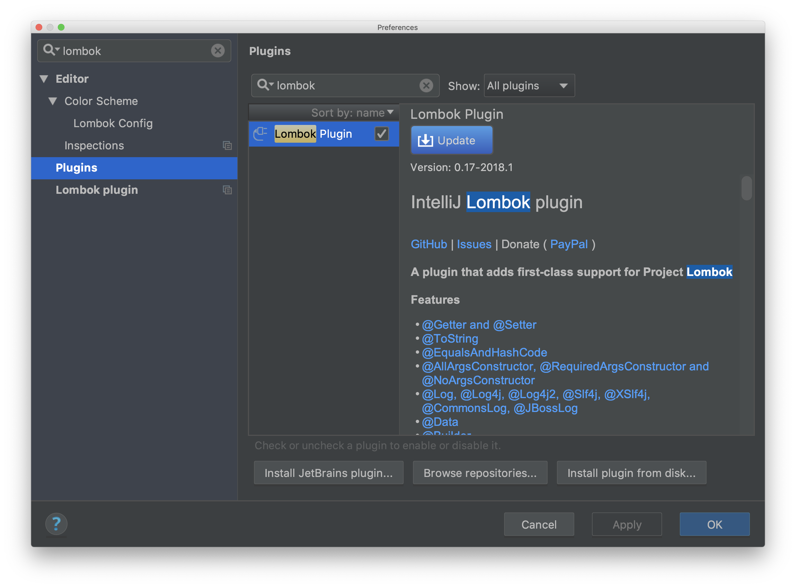
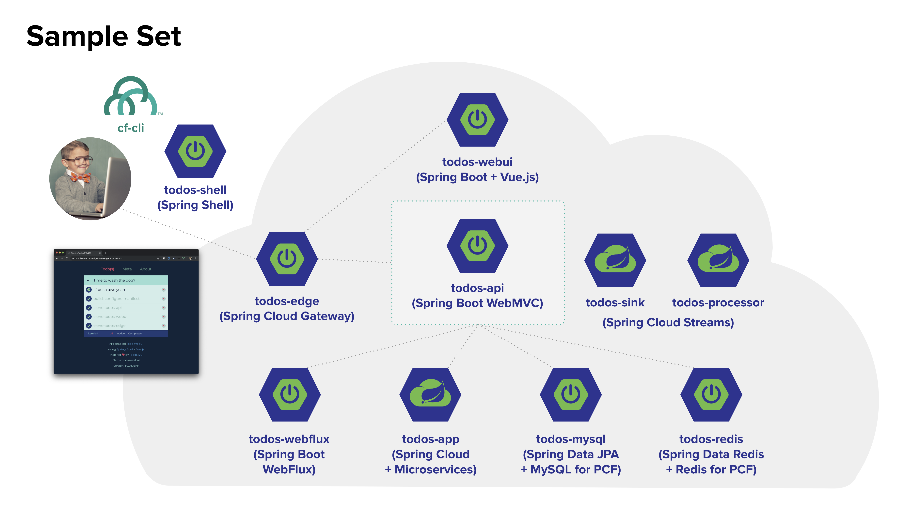
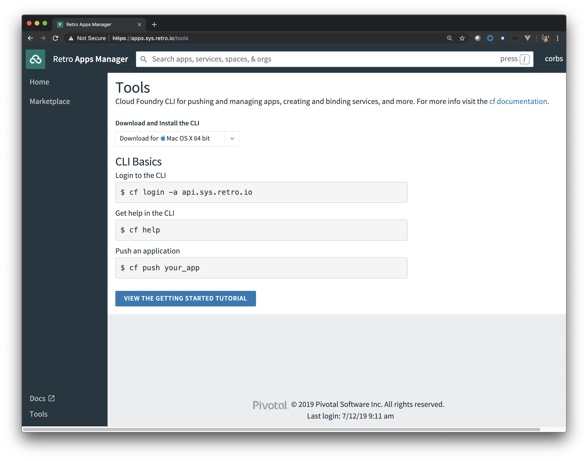
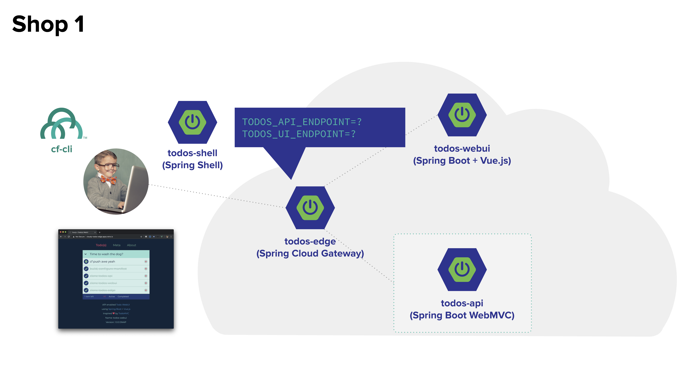
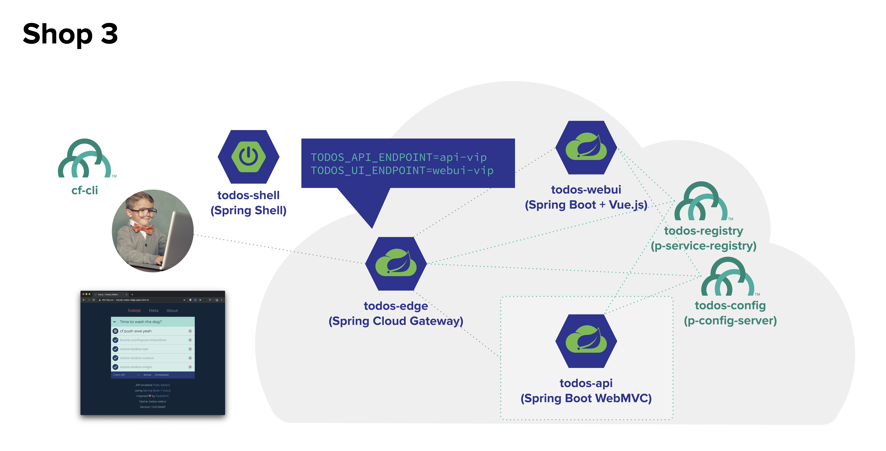

# Todo(s) Workshop

Howdy and welcome!  

This is the [one-and-only doc](#todos-workshop) for how to use the Todo apps together as a sample set.  Each project listed below has it's own README that details app specifics, this doc is an exhaustive list of information on how to use them together on PCF in a workshop format.

* [Audience](#Audience)
* [Need to know](#need-to-know)
    * [PreReqs](#prereqs)
    * [Domain Model](#domain-model)
* [Shop 0](#shop-0) - Setting up projects, PCF accounts and cf push ice-breaker
* [Shop 1](#shop-1) - Introduce Todo sample set (whiteboard or slide with picture)
* [Shop 2](#shop-2) - Internal Routes on PCF
* [Shop 3](#shop-3) - Spring Cloud for Todo sample set
* [Shop 4](#shop-4) - Backing Services with MySQL and Redis for PCF
* [Shop 5](#shop-5) - Spring Cloud Connected Lookaside Caching backend
* [Shop 6](#shop-6) - Spring Cloud Streams integration with RabbitMQ for PCF

## Audience

This content is intended for anyone wanting a sound understanding of Spring Boot on PCF or for anyone wanting to hack around a simple model and get to know salient features of both.  

## PreReqs

### Development

Each project can be cloned, built and pushed to PCF individually.  All that's required to work with projects locally are listed below.

1. Java 8 JDK ([sdkman](https://sdkman.io/sdks#java) is a nice dev option)
    * Be able to run `java` and `javac` from cli  

```bash
> java -version
openjdk version "1.8.0_212"
OpenJDK Runtime Environment (AdoptOpenJDK)(build 1.8.0_212-b03)
OpenJDK 64-Bit Server VM (AdoptOpenJDK)(build 25.212-b03, mixed mode)

> javac -version
javac 1.8.0_212
```

1. [Git client](https://git-scm.com/downloads) to clone projects
    * If you cannot clone from github then download zips from this [S3 bucket](https://CHANGEME).
1. (optional) Maven 3 (again [sdkman](https://sdkman.io/sdks#maven)) - all projects use the [Maven Wrapper](https://github.com/takari/maven-wrapper) so maven installation is optional.
1. (optional) [Make](https://www.gnu.org/software/make/) - for quick clone and other ready made commands
1. [Cloud Foundry CLI](https://github.com/cloudfoundry/cli) - install for your platform.  If you have access to Pivotal Apps Manager you can download the latest cf-cli from the Tools menu.  Check cf-cli version.

```bash
> cf -v      
cf version 6.46.0+29d6257f1.2019-07-09
```
1. A Browser - [Chrome Recommended](https://www.google.com/chrome/)

1. [Curl](https://curl.haxx.se/) or [Httpie](https://httpie.org/) - for being able to manually send various api/app requests.  [Post Man](https://www.getpostman.com/) or any http client you're comfortable with is probably fine.

```bash
# for example use Httpie to update a todo
http PATCH myscs-todos-app.apps.retro.io/f76bebbe \
    title="WATCH all-star game #mlb"
# or list application routes in spring-cloud-gateway component
http foo-todos-edge.apps.retro.io/actuator/gateway/routes
# or curl to encrypt text via spring-cloud config-server
curl -H "Authorization: $(cf oauth-token)" https://config-721a0c02-2ec8-466b-bead-fd127b72d464.apps.retro.io/encrypt -d 'Howdy' -k
```

3. An editor or IDE - All projects were created from the [Spring Initialzr](https://start.spring.io) as Maven for build and Java or Kotlin as the language.  Any editor or IDE will do.  You can use IntelliJ or another IDE such as Eclipse and the source syntax highlighting might show red on generated POJO methods (such as `todos.getTitle()`) unless a Lombok Plugin is added.  In any case you should still be able to edit code and do IDE'less maven builds with or without an IDE plugin...that said make your IDE happy :)

* [IntelliJ Lombok Plugin](https://projectlombok.org/setup/intellij)
* [Eclipse and Spring Tools Suite Lombok Plugin](https://projectlombok.org/setup/eclipse)
* [Visual Studio Code Lombok Plugin](https://projectlombok.org/setup/vscode)



4. Connectivity to Maven and Spring Repositories - you may need to configure a [Maven Proxy](https://CHANGEME)

### Pivotal Cloud Foundry

1. [Pivotal Application Service 2.5 and up](https://docs.pivotal.io/pivotalcf/2-5)
1. [MySQL for PCF 2.5 and up](https://docs.pivotal.io/p-mysql/2-5/index.html)
1. [RabbitMQ for PCF 1.15 and up](https://docs.pivotal.io/rabbitmq-cf/1-15/index.html)
1. [Redis for PCF 2.0 and up](https://docs.pivotal.io/redis/2-0/index.html)
1. [Spring Cloud Services for PCF 2.0.x](https://docs.pivotal.io/spring-cloud-services/2-0/common/index.html)
1. An account on PCF with Space Developer access
1. This sample set consumes at a minimum [5](https://www.youtube.com/watch?v=k6OWSf8_5J4) SIs
    * 1 MySQL SI - todos-mysql, todos-sink
    * 1 Redis SI - todos-redis, todos-app
    * 1 RabbitMQ SI - todos-app, todos-processor, todos-sink
    * 1 Config Server SI - todos-*
    * 1 Service Registry SI - todos-*

## Projects Setup

Project setup is pretty straightforward as each sample is [standard spring boot](https://start.spring.io) with maven. Each is its own "project" and git repository.  So to get all the samples we need to clone multiple repositories...10 to be exact but they're small so its not too bad.

The only **must have** is all projects should exist on the file-system as siblings...at least for general sanity.

So first step is define a local directory to work out of and clone every project into it...see screenshot below as an example.

After you clone or unzip the projects directory should look like so...

```bash
corbs@corbspro:~/Desktop/todos-apps
ls -al
> ./todos-api
> ./todos-app
> ./todos-config
> ./todos-edge
> ./todos-mysql
> ./todos-processor
> ./todos-redis
> ./todos-shell
> ./todos-sink
> ./todos-webui
```

 Apps on File System")

### Cloning Manually

Getting all the sample is easy if you have access to github.  From your working directory clone the 9 Spring Boot projects below.  If you cannot use github download source code as zip from [here](https://CHANGEME).

```bash
mkdir ~/Desktop/todos-apps
cd ~/Desktop/todos-apps
git clone https://github.com/corbtastik/todos-api
git clone https://github.com/corbtastik/todos-app
git clone https://github.com/corbtastik/todos-config
git clone https://github.com/corbtastik/todos-edge
git clone https://github.com/corbtastik/todos-mysql
git clone https://github.com/corbtastik/todos-processor
git clone https://github.com/corbtastik/todos-redis
git clone https://github.com/corbtastik/todos-shell
git clone https://github.com/corbtastik/todos-sink
git clone https://github.com/corbtastik/todos-webui
```

### Clone using Todo(s) Shell

Use the steps below for a quick way to clone all the samples.  However you can easily clone each project as [stated above](#cloning-manually).

```bash
# 1. create and change into your working directory
mkdir ~/Desktop/todos-apps
cd ~/Desktop/todos-apps
# 2. clone todos-shell and change into directory
git clone https://github.com/corbtastik/todos-shell
cd todos-shell
# 3. clone samples to parent directory (todos-apps)
make clone
```

### Building

Every sample can be built using the [Maven Wrapper](https://github.com/takari/maven-wrapper) in each project.  See the `README` in each project for more build information.

```bash
# projects:
#   todos-api,todos-app,todos-edge
#   todos-mysql,todos-processor,todos-redis
#   todos-shell,todos-sink,todos-webui
cd ~/Desktop/todos-apps/todos-api
# by default you should be on master branch
# there are 2 branches for each project (master and cloud)
# git checkout master|cloud
#
# Skip Tests if time is a factor
# ./mvnw clean package -DskipTests
./mvnw clean package
ls target
> target/todos-api-1.0.0.SNAP.jar
```

### Building all using Todo(s) Shell

You can build all samples by using the `Makefile` in `todos-shell`. This requires internet access to Maven Central and Spring Repositories.

To build the cloud brach set `BRANCH=cloud` in the `Makefile`, by default this is set to `master`.

```bash
# assumes make clone has been executed
# change into your working directory and todos-shell project
cd ~/Desktop/todos-apps/todos-shell
# kick off maven builds
make build
# each project's target directory will contain the artifact jar
```

The build places artifacts in each project's `${project}/target` directory.  By default the artifact version is set to `1.0.0.SNAP` and all apps expose this info over `/actuator/info`.

## Projects

The samples listed below are used throughout the workshop, each repository goes into more depth on the app but here's a quick summary of each.  

**Note** - Each project contains a master and cloud branch.  The master branch contains plain-ole Spring Boot apps while the cloud branch adds [Spring Cloud](https://spring.io/projects/spring-cloud) features to each.

Sample | Repository
------------ | -------------
todos-api | https://github.com/corbtastik/todos-api
todos-app | https://github.com/corbtastik/todos-app
todos-config | https://github.com/corbtastik/todos-config
todos-edge | https://github.com/corbtastik/todos-edge
todos-mysql | https://github.com/corbtastik/todos-mysql
todos-processor | https://github.com/corbtastik/todos-processor
todos-redis | https://github.com/corbtastik/todos-redis
todos-shell | https://github.com/corbtastik/todos-shell
todos-sink | https://github.com/corbtastik/todos-sink
todos-webui | https://github.com/corbtastik/todos-webui

### Domain Model

All the samples in this workshop center around the `Todo` model and hence most are named `todos-blah-blah-blah`.  Each project scratches a particular Spring Boot + PCF itch but all share this simple `Todo` type.

```java
@Data
@Builder
@AllArgsConstructor
@NoArgsConstructor
class Todo implements Serializable {
    private String id;
    private String title;
    private Boolean complete = Boolean.FALSE;
}
```

*However* it should be stated that each project maintains it's own implementation of this tiny model.  This gist is a Todo is a String id, String title and Boolean complete flag and that's it.  String as id perhaps is a good talking point around how id(s) should be typed and managed for certain use-cases.  Also considerations around what really needs an id anyway, who should own the id and such.  This sample set uses String (UUID) as an id and app code "owns" dealing out new ones...database id generation isn't used.

**Apropos**

* [`java.util.UUID`](https://docs.oracle.com/javase/8/docs/api/java/util/UUID.html)
* [Mongo ObjectId](https://docs.mongodb.com/manual/reference/method/ObjectId/)
* [Mongo Blog Post](https://www.mongodb.com/blog/post/generating-globally-unique-identifiers-for-use-with-mongodb)
* [Sonyflake distributed ids](https://github.com/sony/sonyflake)  

### todos-api

[Todo(s) API](https://github.com/corbtastik/todos-api) is a sample Spring Boot service that uses `spring-boot-starter-web` to implement a Spring MVC based REST API for `Todo(s)`.  Not listed in this set but similar is [todos-webflux](https://github.com/corbtastik/todos-webflux) which is the same API implemented using `spring-boot-starter-webflux` and hence non-blocking (and uses Netty container).

This is nice Spring Boot ice-breaker app and hacks at core Spring Boot features such as using the Spring Boot Starter pom, Auto-configuration, Property Sources, Configuration Properties, embedded Containers and Logging.  During the workshop we'll use Spring Cloud to connect persistence backends that implement the same HTTP CRUD API.

**Talking Points**

* Spring Boot and its advantages
* Spring Boot Starter POM
* Spring Boot Auto Configuration
* Spring Boot Property Sources
* Spring Boot embedded Containers
* Spring Boot logging
* Spring Boot Web stacks (Spring WebMVC and Spring WebFlux)
* [Spring Framework](https://spring.io/)
* [Spring Boot](https://spring.io/projects/spring-boot)
* [Java Buildpack](https://github.com/cloudfoundry/java-buildpack)
* Spring Auto Reconfiguration - key is understanding the levels of auto-configuration at play on PCF

### todos-edge

[Todo(s) Edge](https://github.com/corbtastik/todos-edge) is an edge for other Todo apps and serves as a client entry-point into app functionality, implemented using [Spring Cloud Gateway](https://spring.io/projects/spring-cloud-gateway).  The source is Kotlin however there's remarkably little code as the gateway is virtually all configuration.  By default the edge is configured to route traffic sent to `/todos/` to a backing API of some sort while root traffic routes to the UI.  During certain sections of the workshop we'll use Spring Cloud to control where the edge sends traffic.

**Talking Points**

* Kotlin
* Kotlin support in Spring
* Spring WebFlux
* Spring Cloud Gateway
* Netty

### todos-webui

A sample frontend [Vue.js](https://vuejs.org/) app wrapped in Spring Boot goodness.

* [Spring Boot](https://spring.io/projects/spring-boot) for app bits, using webflux runtime
* [Vue.js](https://vuejs.org/) for frontend, inspired by [TodoMVC Vue App](http://todomvc.com/examples/vue/), difference is this one is vendored as a Spring Boot app and calls a backing endpoint (``/todos``)

This application assumes the ``/todos`` endpoint is exposed from the same "origin".  Because of this its best to use this application behind the [todos-edge](#todos-edge) which will serve as a gateway and single origin to the client for both loading ``todos-webui`` and for proxying API calls to ``/todos``.

 WebUI")

### todos-mysql

Inevitably you'll need to implement Microservices to talk with Databases. [Todo(s) MySQL](https://github.com/corbtastik/todos-mysql) contains a Microservice implemented in Kotlin using [Spring Boot](https://docs.spring.io/spring-boot/docs/current/reference/html/) and [Spring Cloud](https://spring.io/projects/spring-cloud) under-pinnings, [Spring Data JPA](https://docs.spring.io/spring-boot/docs/current/reference/html/boot-features-sql.html#boot-features-jpa-and-spring-data) for data binding and [Flyway](https://docs.spring.io/spring-boot/docs/current/reference/html/howto-database-initialization.html#howto-execute-flyway-database-migrations-on-startup) for database initialization.  It can be used as a standalone data service or as a backend for a Todo app.

> [Spring Framework 5](https://spring.io/blog/2017/01/04/introducing-kotlin-support-in-spring-framework-5-0) added support for [Kotlin](https://kotlinlang.org/). Developers can now implement Microservices in [Java](https://en.wikipedia.org/wiki/Java_(programming_language)), [Groovy](https://groovy-lang.org/) and [Kotlin](https://kotlinlang.org/). Kotlin is [starting to show up in development communities](https://www.thoughtworks.com/radar/languages-and-frameworks/kotlin) given most like the simplified syntax. If you're a Java developer you'll get up to speed on Kotlin quickly because it's very Java like but with [lots of simplifications](https://kotlinlang.org/docs/reference/comparison-to-java.html).

Todo(s) Data uses Flyway to handle database schema creation and versioning. Using Flyway from Spring Boot starts with declaring a dependency on `org.flywaydb:flyway-core` in `pom.xml` and Spring Boot will Auto Configure on startup.  Spring profiles are used to boot into different database context, the default profile initiates H2 while the "cloud" profile used MySQL.

**Talking Points**

* Kotlin
* Spring Data
* Spring Data JPA
* Flyway
* MySQL for PCF

### todos-redis

[Todo(s) Redis](https://github.com/corbtastik/todos-redis) is a simple [Spring Data Redis](https://docs.spring.io/spring-boot/docs/current/reference/html/boot-features-nosql.html#boot-features-redis) backend for a Todo API.  It's used as the default "caching" layer in the workshop sample set.

**Talking Points**

* [Redis](https://redis.io/)
* [Redis Hashes](https://redis.io/topics/data-types)
* [Redis cli](https://redis.io/topics/rediscli)
* [Redis for PCF](https://docs.pivotal.io/redis/index.html)
* [Spring Data Redis](https://docs.spring.io/spring-data/redis/docs/reference/html/)
* [Caching Use Cases and Patterns](https://content.pivotal.io/blog/an-introduction-to-look-aside-vs-inline-caching-patterns)

### todos-app

Todo(s) App is a composite backend for a fully functional Todo app, it contains look-aside caching and business logic and uses Spring Cloud for app to app connectivity.  We'll see how to configure a fully functional Todo application using this backend which integrates with a System of Record (Sor) service and a Cache service. All enabled with Spring Cloud, MySQL for PCF and Redis for PCF.

**Talking Points**

* [Spring Cloud Services for PCF](https://docs.pivotal.io/spring-cloud-services/common/index.html)
* [MySQL for PCF](https://docs.pivotal.io/p-mysql/index.html)
* [Redis for PCF](https://docs.pivotal.io/redis/index.html)
* Configuration Server and Service Registry
* RestTemplate and Client Side Load-balancing
* [Pivotal Blog - Caching Patterns](https://content.pivotal.io/blog/an-introduction-to-look-aside-vs-inline-caching-patterns)

### todos-shell

Todo(s) shell is a [Spring Shell](https://projects.spring.io/spring-shell/) application used to automate configuration and deployment of Todo apps to PCF.  It uses the [CF Java Client](https://github.com/cloudfoundry/cf-java-client), your CF credentials and your locally compiled `todos-*` jars to automate app deployment to PCF.

The list of shell commands

```bash
push-app: todos-edge,todos-api,todos-webui NO spring-cloud
push-scs: push-app with spring-cloud    
push-internal: push-app with private app networking
push-lookaside: todos-edge,todos-app,todos-webui with spring-cloud
push-my-sql: todos-edge,todos-mysql,todos-webui NO spring-cloud
push-scs-my-sql: todos-edge,todos-mysql,todos-webui with spring-cloud
push-redis: todos-edge,todos-redis,todos-webui NO spring-cloud
push-scs-redis: todos-edge,todos-redis,todos-webui with spring-cloud    
```

**Talking Points**

* [Spring Shell](https://projects.spring.io/spring-shell/)
* [CF Java Client](https://github.com/cloudfoundry/cf-java-client)

---

## Shop Sample Set



## Shop 0

### Setting up projects, PCF accounts and cf push ice-breaker

This Shop is all about getting started with the projects and doing a CF push ice-breaker.

1. Complete [Projects Setup](#projects-setup) and [initial build](#building)
1. You should have these projects cloned to the same directory on your machine

    ```bash
    cd ~/Desktop/todos-apps
    ls
    > ./todos-api
    > ./todos-app
    > ./todos-edge
    > ./todos-webui
    > ./todos-mysql
    > ./todos-processor
    > ./todos-redis
    > ./todos-shell
    > ./todos-sink
    ```
1. Make sure you've installed the [Cloud Foundry CLI](https://github.com/cloudfoundry/cli) as mentioned in [PreReqs](#prereqs)
1. Login to Pivotal Cloud Foundry with CLI - *Note* you will need your username and password for PCF.

    ```bash
    # -a use your API endpoint,
    # skip SSL cert validation if you're using self-signed certificates
    # --skip-ssl-validation
    $ cf login -a api.sys.retro.io
    ```
1. [Login to Pivotal Apps Manager](https://docs.pivotal.io/pivotalcf/customizing/console-login.html), typically this is hosted at `apps.YOUR-SYSTEM-DOMAIN`, in this sample my System Domain is `sys.retro.io`, yours will be different.
1. If needed you can use Pivotal Apps Manager to download the cf-cli for your OS as well as copy the required `cf login` command for your PCF endpoint.



7. Compile and Push ice-breaker [App](#todos-api) - Now is a good time to talk about what PCF did to containerize and bring the app online.

Edit the manifest.yml in `todos-api` to `YOUR` liking.  Use a unique name for `YOUR` application name.

**manifest.yml**

```yaml
---
applications:
# use something unique, for example your-todos-api
- name: your-todos-api
memory: 1G
path: target/todos-api-1.0.0.SNAP.jar
buildpack: java_buildpack
env:
    TODOS_API_LIMIT: 1024
```

**compile and push**

```bash
cd ~/Desktop/todos-apps/todos-api
# git checkout master # (should already be on master branch)
./mvnw clean package
cf push
```

PCF is capable of containerizing many different types of applications, take a look at these samples to get a feel for what PCF supports.

> 1. [Java examples](https://github.com/cloudfoundry/java-buildpack#examples)
> 1. [CF Sample Apps](https://github.com/cloudfoundry-samples)
> 1. [SSO Samples](https://github.com/pivotal-cf/identity-sample-apps)


8. Grok the cf-cli - run the following commands
    1. `cf -v`
    1. `cf target`
    1. `cf domains`
    1. `cf buildpacks`
    1. `cf marketplace`
    1. `cf logs your-todos-api --recent`

---

## Shop 1

### Introduce Todo sample set (whiteboard or slide with picture)

In this Shop we're going to build a simple 3 service App that consist of a [backing API](#todos-api) implemented in Spring Boot, a [UI which is a Spring Boot vendored Vue.js app](#todos-webui) and an Edge implemented with Spring Cloud Gateway to help with application level routing.

This Shop is plain-ole Spring Boot without Spring Cloud (which is later) and relies simply on core PCF features.

At the end of this Shop you'll have 3 apps running in PCF that have been manually configured to work together.



### 1. Build

This assumes you've completed [Projects Setup](#projects-setup), if not please check that box.

Manual steps to build.

```bash
# change into your working directory (i.e. todos-apps)
cd ~/Desktop/todos-apps
cd todos-api
./mvnw clean package
cd ../todos-edge
./mvnw clean package
cd ../todos-webui
./mvnw clean package
cd ..
```

A successful build puts a Spring Boot jar in each projects `target` directory, for example you should have these jars after building

* [`todos-api`](#todos-api)
* [`todos-edge`](#todos-edge)
* [`todos-webui`](#todos-webui)

```bash
cd ~/Desktop/todos-apps
# jars after build
./todos-api/target/todos-api-1.0.0.SNAP.jar
./todos-edge/target/todos-edge-1.0.0.SNAP.jar
./todos-webui/target/todos-webui-1.0.0.SNAP.jar
```

### 2. Push to PCF

Pick a unique "**tag**" and stick with it throughout the workshop, in the docs and snippets below this is represented by the text `YOUR`.

* Configure manifests for
    * `todos-api/manifest.yml`
    * `todos-webui/manifest.yml`
    * `todos-edge/manifest.yml`
* `cf domains` - to figure out which domains you fall under
    * In the snippet below `apps.retro.io` is the cf domain
    * On PWS the domain would be `cfapps.io`
* `cf buildpacks` - to figure out the exact java buildpack name, its safe to remove the `buildpack` property from the `manifest.yml` files and let PCF figure out which to use
    * This sample set uses the [Java Buildpack](https://github.com/cloudfoundry/java-buildpack)

#### todos-api manifest

```yaml
---
applications:
- name: todos-api
  memory: 1G
  path: target/todos-api-1.0.0.SNAP.jar
  buildpack: java_buildpack
  env:
    TODOS_API_LIMIT: 1024
```

#### Push todos-api to PCF

Replacing `YOUR` with your unique app tag.  **Note** - Leave the `-todos-api` suffix.

* `cf push YOUR-todos-api`

```bash
cd ~/Desktop/todos-apps/todos-api
# edit todos-api/manifest.yml to your liking or simply push
cf push your-todos-api
# pcf will use the java buildpack to create a container image
# and start that image up as a container instance with networking
cf apps
> Getting apps in org retro / space arcade as corbs...
> OK
> name         state   instances memory disk urls
> your-todos-api started 1/1       1G     4G   your-todos-api.apps.retro.io
```

* `cf logs YOUR-todos-api --recent` - take a gander at the startup logs

#### todos-webui manifest

Customize the UI text entry placeholder if you wish.

```yaml
---
applications:
- name: todos-webui
  memory: 1G
  path: target/todos-webui-1.0.0.SNAP.jar
  buildpack: java_buildpack
  env:
    TODOS_UI_PLACEHOLDER: 'Time to wash the dog?'
```

#### Push todos-webui to PCF

Replacing `YOUR` with your unique app tag.  **Note** - Leave the `-todos-webui` suffix.

* `cf push YOUR-todos-webui`

```bash
cd ~/Desktop/todos-apps/todos-webui
# edit todos-webui/manifest.yml to your liking or simply push
cf push your-todos-webui
# pcf will use the java buildpack to create a container image
# and start that image up as a container instance with networking
cf apps
> Getting apps in org retro / space arcade as corbs...
> OK
> name             state   instances memory disk urls
> your-todos-webui started 1/1       1G     4G   your-todos-webui.apps.retro.io
```

* Open your todos-webui url in a browser ([Chrome recommended](https://www.google.com/chrome/)) and notice the failed resource error.  The UI isn't connected to anything at this point.

 WebUI endpoint")

#### todos-edge manifest

The critical configuration here is getting the routes entered for the API and UI apps.

```bash
---
applications:
- name: YOUR-todos-edge
  memory: 1G
  path: target/todos-edge-1.0.0.SNAP.jar
  env:
  # add YOUR endpoints
    TODOS_UI_ENDPOINT: https://YOUR-todos-webui.apps.retro.io
    TODOS_API_ENDPOINT: https://YOUR-todos-api.apps.retro.io
```

#### Push todos-edge to PCF

```bash
cd ~/Desktop/todos-apps/todos-edge
# edit todos-edge/manifest.yml with your API and UI endpoints
cf push your-todos-edge
# pcf will use the java buildpack to create a container image
# and start that image up as a container instance with networking
cf apps
> Getting apps in org retro / space arcade as corbs...
> OK
> name            state   instances memory disk urls
> your-todos-edge started 1/1       1G     4G   your-todos-edge.apps.retro.io
```

* Open `todos-edge` in Chrome
    * You'll have a route to your `todos-edge` app...for example `https://your-todos-edge.apps.retro.io`

 Edge endpoint")

* Create, Read, Update and Delete Todo(s) from the UI and verify all is well
* Slap a high-five or something as you've manually completed pushing the app

### Extra Mile

* Create a custom route in cf and map to your `todos-edge` to `SOMETHING`
    * `cf map-route your-todos-edge apps.retro.io --hostname SOMETHING`
* Use [Todo(s) Shell](#todos-shell) to automate the deployment of the same three apps as a single functioning "Todo app" on PCF with one command.  The shell will use your PCF creds and push configured apps to the platform.  The deploy results in 3 apps running (`todos-edge`,`todos-api`,`todos-webui`) each with a user provided "tag" which will prefix the running instances.
    * `shell:>push-app --tag corbs`

Pause...take a quick review and field questions

### Talking Points

* Intro to Spring Boot and [Sample Set](#shop-sample-set)
* Introduce Spring Cloud Gateway as an application edge and routing tool
* Code or inspect [Todo Edge](#todos-edge), [Todos API](#todos-api) and [Todos WebUI](#todos-webui) locally, inspect both master and cloud branches for differences, note cloud branch uses Spring Cloud semantics for connectivity so we can stop maintaining URIs and such.  
* Introduce WebUI and simply show it's a Spring Boot app vendoring a frontend Javascript/HTML/CSS app.

---

## Shop 2

### Internal Routes on PCF

We can restrict access to the Backend API and UI by removing public routes for those apps and then mapping them to an internal domain (``apps.internal``).  Once the apps have an internal route we can add a network policy that allows the Edge to call them.

1. Repeat pushing `YOUR-todos-api` and `YOUR-todos-webui` but this time set the [domain](https://docs.pivotal.io/pivotalcf/devguide/deploy-apps/routes-domains.html) to an internal one.

    ```bash
    # YOUR-todos-api
    cd ~/Desktop/todos-apps/todos-api
    cf domains
    > name                 status   details
    > apps.retro.io        shared          
    > mesh.apps.retro.io   shared          
    > apps.internal        shared   internal
    cf push your-todos-api -d apps.internal
    ```

    ```bash
    # YOUR-todos-webui
    cd ~/Desktop/todos-apps/todos-webui
    cf push your-todos-webui -d apps.internal
    ```

1. Use cf set-env to update endpoints on `YOUR-todos-edge` to the internal ones

    ```bash
    # YOUR-todos-edge
    cd ~/Desktop/todos-apps/todos-edge
    cf set-env your-todos-edge \
        TODOS_API_ENDPOINT http://your-todos-api.apps.internal:8080
    cf set-env your-todos-edge \
        TODOS_UI_ENDPOINT http://your-todos-webui.apps.internal:8080
    ```

1. Un-map public routes for `YOUR-todos-api` and `YOUR-todos-webui`

    ```bash
    # unmap the public routes for API and UI
    cd ~/Desktop/todos-apps/todos-edge
    cf unmap-route your-todos-api apps.retro.io --hostname your-todos-api
    cf unmap-route your-todos-webui apps.retro.io --hostname your-todos-webui
    ```

1. Restage `YOUR-todos-edge`

    ```bash
    cd ~/Desktop/todos-apps/todos-edge
    cf restage your-todos-edge
    ```

1. Add network policy to allow access to `YOUR-todos-api` and `YOUR-todos-webui` from only `YOUR-todos-edge`

    ```bash
    cd ~/Desktop/todos-apps/todos-edge
    cf add-network-policy your-todos-edge --destination-app your-todos-api
    cf add-network-policy your-todos-edge --destination-app your-todos-webui
    cf network-policies
    Listing network policies in org retro / space arcade as corbs...
    source       destination   protocol   ports
    todos-edge   todos-api     tcp        8080
    todos-edge   todos-webui   tcp        8080
    ```

1. Open `YOUR-todos-edge` in Chrome
    * You'll have a route to your `YOUR-todos-edge` app...for example `https://your-todos-edge.apps.retro.io`

### Extra mile

* Use [Todo(s) Shell](#todos-shell) to automate pushing the apps with private networking
    * `shell:>push-internal --tag myinternalapp`

### Talking Points

* Note that only your edge application can communicate with the API and UI and now those deployments aren't over exposed on the network.  This is accomplished by [Container to Container networking](https://docs.pivotal.io/pivotalcf/devguide/deploy-apps/cf-networking.html) in PCF.

---

## Shop 3

### Spring Cloud for Todo sample set

This Shop is about getting familiar with [Spring Cloud Services for PCF](https://docs.pivotal.io/spring-cloud-services/common/index.html) by adding [Spring Cloud](https://spring.io/projects/spring-cloud) dependencies to the Todo(s) sample set.  Once this Shop is complete you'll have virtually the same deployment of apps with the added benefit of Spring Cloud to handle Configuration and Connectivity.



### Git Repository for application config

First things first is getting a git-repo that you have read/write access on to save and pull app configs.

* If forking from github is an option then [fork this repository](https://github.com/corbtastik/todos-config) and clone into your samples working directory.  After the clone your samples working directory should look like so.  *Note* you may need to remove the existing `todos-config` folder in your samples working directory first.

    ```bash
    cd ~/Desktop/todos-apps
    ls
    > ./todos-api
    > ./todos-app
    > ./todos-config # from fork-clone
    > ./todos-edge
    > ./todos-webui
    > ./todos-mysql
    > ./todos-processor
    > ./todos-redis
    > ./todos-shell
    > ./todos-sink
    ```

* If forking isn't an option then commit the `todos-config` folder to a new git-repo (replace `YOUR-GITHUB-ACCT` below) that you have access to.

    For example:

    ```bash
    cd ~/Desktop/todos-apps/todos-config
    rm -rf .git # to remove existing git-repo
    git init
    git add *.yml
    git commit -m "Initial commit - adding all application configs"
    git remote add origin git@github.com:YOUR-GITHUB-ACCT/todos-config.git
    git push -u origin master
    ```

### Creating a Spring Cloud Config Service Instance

We want to control application configurations from a central place and [Spring Cloud Config server](https://docs.pivotal.io/spring-cloud-services/2-0/common/config-server/index.html) is a great way to get up and running.  First let's create a basic Spring Cloud Config Service instance and configure with your `todos-config` repository.

Use `cf create-service` to provision `YOUR` Config Service instance, passing `-c` some configuration that points to the backing git-repo.

```bash
cd ~/Desktop/todos-apps/pcf-config-server
cf create-service p-config-server standard your-todos-config \
    -c '{"git": { "uri": "https://github.com/corbtastik/todos-config", "label": "master" } }'
# after a few moments check the status
cf service your-todos-config
> name:      your-todos-config
> service:   p-config-server
> status:    create succeeded
```

### Creating a Spring Cloud Service Registry Instance

We also want an eco-system where applications can connect with other applications and remove the burden of needing to configure URLs and client-side application access.  [Spring Cloud Service Registry](https://docs.pivotal.io/spring-cloud-services/2-0/common/service-registry/index.html) can help "connect" our apps in a Spring Cloud context.

Use `cf create-service` to provision `YOUR` Service Registry instance.

```bash
cd ~/Desktop/todos-apps/pcf-service-registry
cf create-service p-service-registry standard your-todos-registry
# after a few moments check the status
cf service your-todos-registry
> name:      your-todos-registry
> service:   p-service-registry
> status:    create succeeded
```

### Inspect cloud branch

Switch to cloud branch on `todos-edge`, `todos-api`, `todos-webui` samples, you may need to stash or commit local code changes to master branch before checking out cloud.

```bash
cd ~/Desktop/todos-apps/todos-api
git checkout cloud
cd ~/Desktop/todos-apps/todos-edge
git checkout cloud
cd ~/Desktop/todos-apps/todos-webui
git checkout cloud
```

* Code and/or inspection time
    * Spring Cloud Services dependencies
    * Open Source Spring Cloud versions
    * Application configuration

### Build Spring Cloud apps

Build Spring Cloud ready versions of `todos-edge`, `todos-api` and `todos-webui`

Manual steps to build, same as before except this time we build with [spring-cloud dependencies](https://docs.pivotal.io/spring-cloud-services/2-0/common/client-dependencies.html).

Each `pom.xml` on the `cloud` branch will contain these Spring Cloud Services dependencies.  See [Including Spring Cloud Services Dependencies](https://docs.pivotal.io/spring-cloud-services/2-0/common/client-dependencies.html#including-dependencies).

```xml
    <dependencies>
        <!-- Required for SCS Config Server
             brings in Spring Cloud Config Client
             and Spring Security OAuth 2 -->
        <dependency>
            <groupId>io.pivotal.spring.cloud</groupId>
            <artifactId>
                spring-cloud-services-starter-config-client
            </artifactId>
        </dependency>
        <!-- Required for SCS Service Discovery
            brings in Spring Cloud Netflix Eureka Client,
            Jersey Client, Spring Security OAuth 2 -->
        <dependency>
            <groupId>io.pivotal.spring.cloud</groupId>
            <artifactId>
                spring-cloud-services-starter-service-registry
            </artifactId>
        </dependency>

    <!-- other dependencies -->
    </dependencies>
```

```bash
# change into your working directory (i.e. todos-apps)
cd ~/Desktop/todos-apps
cd todos-api
./mvnw clean package
cd ../todos-edge
./mvnw clean package
cd ../todos-webui
./mvnw clean package
cd ..
```

### Configure manifests for Spring Cloud apps

Configure manifests to bind to Spring Cloud services instances created above

Spring Cloud Services uses HTTPs for all client-to-service communication.  The `TRUST_CERTS` environment variable is applicable if your PCF environment uses Self-Signed Certificates.  Spring Cloud Services will add this Self-Signed Certificate to the JVM trust-store so Spring Cloud pushed apps can register and consume Spring Cloud Services using HTTPs.

Set `TRUST_CERTS` to your PCF api endpoint (`cf target`), if you're using Self-Signed Certificates.

Edit the manifests for `YOUR` apps, making sure the `services` configuration has `YOUR` Config Server and Service Registry instance.

#### todos-api cloud manifest

```yaml
---
applications:
- name: your-todos-api
  memory: 1G
  path: target/todos-api-1.0.0.SNAP.jar
  buildpack: java_buildpack
  services:
  - your-todos-config
  - your-todos-registry
  env:
    TRUST_CERTS: api.sys.retro.io
```

#### todos-webui cloud manifest

```yaml
---
applications:
- name: your-todos-webui
  memory: 1G
  path: target/todos-webui-1.0.0.SNAP.jar
  services:
  - your-todos-config
  - your-todos-registry
  env:
    TRUST_CERTS: api.sys.retro.io
```

#### todos-edge cloud manifest

```yaml
---
applications:
- name: todos-edge
  memory: 1G
  routes:
  - route: todos-edge.apps.retro.io
  - route: todos.apps.retro.io  
  path: target/todos-edge-1.0.0.SNAP.jar
  services:
  - todos-config
  - todos-registry
  env:
    TRUST_CERTS: api.sys.retro.io
```

### Push Spring Cloud apps to PCF

#### Push todos-api cloud

Replacing `YOUR` with your unique app tag.  **Note** - Leave the `-todos-api` suffix.

* `cf push YOUR-todos-api` - PCF will again use the Java Buildpack to containerize the application and schedule a container instance to run our Spring Cloud app.

```bash
cd ~/Desktop/todos-apps/todos-api
cf push your-todos-api
cf apps
> Getting apps in org retro / space arcade as corbs...
> OK
> name         state   instances memory disk urls
> your-todos-api started 1/1       1G     4G   your-todos-api.apps.retro.io
```

#### Push todos-webui cloud

Replacing `YOUR` with your unique app tag.  **Note** - Leave the `-todos-webui` suffix.

* `cf push YOUR-todos-webui` - PCF will again use the Java Buildpack to containerize the application and schedule a container instance to run our Spring Cloud app.

```bash
cd ~/Desktop/todos-apps/todos-webui
cf push your-todos-webui
cf apps
> Getting apps in org retro / space arcade as corbs...
> OK
> name         state   instances memory disk urls
> your-todos-webui started 1/1       1G     4G   your-todos-webui.apps.retro.io
```

#### Push todos-edge cloud

Replacing `YOUR` with your unique app tag.  **Note** - Leave the `-todos-edge` suffix.

* `cf push YOUR-todos-edge` - PCF will again use the Java Buildpack to containerize the application and schedule a container instance to run our Spring Cloud app.

```bash
cd ~/Desktop/todos-apps/todos-edge
cf push your-todos-edge
cf apps
> Getting apps in org retro / space arcade as corbs...
> OK
> name         state   instances memory disk urls
> your-todos-edge started 1/1       1G     4G   your-todos-edge.apps.retro.io
```

### Sync Point

* Review what PCF together with Spring Cloud Services did to bind backing services and for the apps to pull cloud configs and register with Service Registry.
* Make config change to todos-webui `placeholder` property to customize the UI placeholder.
* Refresh Todos WebUI
* Show updated placeholder on WebUI and walk through how the refresh works
* Next steps - refresh bus, encrypted values
* Extra mile - Use Todo Shell to automate pushing Spring Cloud Service ready apps
    * `shell:>push-scs --tag myscsapp`

---

## Shop 4

### Introduce backing services MySQL and Redis for PCF

* Refer back to the picture we're building...it would be nice to swap out todos-api which is just keeping an internal map of the data with something more apropos.  For instance with a database like MySQL or NoSQL store like Redis.
* Introduce
    * Spring Data at large
    * Spring Data Rest
    * Spring Data JPA
    * Spring Data Repositories, Crud and Paging
    * Spring Data Redis non-reactive and reactive
    * MySQL for PCF
    * Redis for PCF
* Inspect todos-mysql and todos-redis
* Compile, configure and cf push both
* Configure todos-edge with todos-mysql backend in git repo
* Refresh todos-edge
* Access your Todo(s) app and take note of data persistence in backing MySQL db
* Repeat the process again, configuring your todos-edge to use todos-redis instead
* Extra mile stuff - Using todos-shell deploy a ready made Todo(s) App with a MySQL backed API by running `shell:>push-scs-my-sql --tag myscs`
* Discuss pros and cons of both types of stores
* Start to introduce caching use-cases, patterns and position Pivotal Cloud Cache

What have you done up to this point?  ...At this point in the shop each attendee should have coded, inspected, modified Spring Boot source code to at least 1 of 5 repositories, or perhaps just implemented some of these samples by hand as some have actually done.  At any rate attendees have seen and/or originated code for an Edge, API and/or UI app with and without Spring Cloud.  Been introduced to Java life on PCF (i.e. Java Buildpack and its features and perhaps with how to control), developers always want to know about JAVA_OPS, vm args and debugging java apps), how containers are built and the benefits of platform baked containers.  Folks should also have been introduced to backing services on PCF and how such services are consumed from Spring Boot apps.  This brings about an opportunity to discuss Spring Auto Reconfiguration in the Java Buildpack.  Developers at this point will typically ask questions around "Connection Pooling and Management", where does the DataSource come from?  

---

## Shop 5

### Spring Cloud Connected Lookaside Caching backend

This Shop puts together a backend for our Todo(s) app that implements Lookaside caching at the app level and leverages previously deployed todos-mysql and todos-redis instances as the System of Record and Cache respectively.  This Shop is focused on using cloud-native connectivity baked into Spring Cloud apps, for example the Lookaside Caching app (todos-app) integrates with the Sor and Cache using DiscoveryService and hence is able to leverage internal name resolution.  IPs and URIs come and go, Spring Cloud can go a long way to insulate application code from physical network properties.

*Note* that todos-app also fires events that Streams deployed in Shop 7 will use.

1. Inspect code for todos-app, discuss how DiscoveryService and RestTemplate gets created and name resolution in Spring Cloud
1. Configure VIPs for the Sor and Cache on Lookaside app
1. Push Lookaside Caching Backend
1. Configure Edge to use Lookaside Caching Backend
1. Refresh Edge
1. Access the UI

---

## Shop 6

### Spring Cloud Streams integration with RabbitMQ for PCF

In this Shop we code, inspect and deploy 3 Spring Cloud Stream apps and integrate using RabbitMQ for PCF to handle messaging.  

1. Code, Inspect and Build todos-sink and todos-processor
1. Create an on-demand rabbitmq service if one has not already been created, call it `todos-messaging` or `${yourname}-todos-messaging`.
1. Configure todos-sink and todos-processor with the rabbitmq service
1. Configure todos-sink and todos-processor with Spring Cloud services
1. Push the 2 apps to PCF
1. Note two things
    1. Now events being sent from todos-app are being written to the Sor
    1. Any Todo entered with a "hashtag" will be indexed (i.e. "Get some peanut butter #groceries")
1. Where to go from here?  Spring Cloud Tasks then Spring Cloud Data Flow
